```mermaid
flowchart TD
    APP(["AlquilaMatch"])

    APP --> M1["1. Entrar"]
    APP --> M2["2. Publicar anuncio"]
    APP --> M3["3. Gestionar solicitudes"]
    APP --> M4["4. Gestionar mis anuncios"]
    APP -.-> I["Lado de la inquilina"]
    APP -.-> X["Fuera del alcance"]

    M1 --> A1["Registro e inicio de sesión"]
    M1 --> A2["Elegir rol: publico"]

    M2 --> B1["Tipo: habitación / depto / casa"]
    M2 --> B2["Precio + servicios incluidos<br/><i>obligatorio</i>"]
    M2 --> B3["Mascotas y restricciones<br/><i>obligatorio</i>"]
    M2 --> B4["Ubicación por GPS<br/>+ ajuste en el mapa"]
    M2 --> B5["Fotos desde la cámara<br/>selladas con fecha"]
    M2 --> B6["Vista previa sin contacto"]

    M3 --> C1["Bandeja de solicitudes<br/>con condiciones ya aceptadas"]
    M3 --> C2["Aprobar o rechazar"]
    M3 --> C3["Al aprobar se libera<br/>el contacto"]

    M4 --> D1["Disponible / Ya alquilado<br/><i>en un toque</i>"]
    M4 --> D2["Editar anuncio"]

    I -.-> I1["Buscar con filtros, ver anuncio,<br/>solicitar visita"]

    X -.-> X1["Pagos y contratos"]
    X -.-> X2["Chat interno"]
    X -.-> X3["Reseñas y verificación"]
    X -.-> X4["Versión web"]

    classDef si fill:#cfe2f3,stroke:#0b5394,color:#000
    classDef luego fill:#fff2cc,stroke:#bf9000,color:#000
    classDef no fill:#f0f0f0,stroke:#999,color:#555,stroke-dasharray: 4 3
    classDef raiz fill:#c9daf8,stroke:#1155cc,color:#000

    class APP raiz
    class M1,M2,M3,M4,A1,A2,B1,B2,B3,B4,B5,B6,C1,C2,C3,D1,D2 si
    class I,I1 luego
    class X,X1,X2,X3,X4 no
```

# App Map v0.1 — AlquilaMatch

**Integrantes:** Gabriel Mamani Sandoval, Daniel Joaquin Mamani Peña · **Fecha:** 20/08/2026

Partes de la app **del lado del propietario**, con el alcance marcado.

🟦 entra en la v0.1 (lado propietario) · 🟨 existe, se mapea en la v0.2 · ⬜ fuera del alcance del producto

---

---

**El corazón del mapa es el módulo 2, y en particular sus dos campos obligatorios.** Ahí es donde el producto existe o no existe: si el precio final y la política de mascotas se pueden dejar vacíos, la app termina siendo otro tablón de anuncios como los grupos de Facebook.

**El módulo 3 es el que le paga a Marta el trabajo del módulo 2.** Su teléfono no está en ningún lado del anuncio; recién aparece en la interfaz de la inquilina después de que ella aprueba. Ese es el trato: llenás más campos, recibís menos mensajes y elegís a quién le contestás.
