```mermaid
flowchart TD
    APP(["AlquilaMatch"])

    APP --> M0["0. Entrar"]
    APP --> PRO["🟦 Lado propietario"]
    APP --> INQ["🟩 Lado inquilina"]
    APP -.-> X["Fuera del alcance"]

    M0 --> A1["Registro e inicio de sesión"]
    M0 --> A2["Elegir rol:<br/>publico / busco"]

    PRO --> N1["1. Publicar anuncio"]
    PRO --> N2["2. Gestionar solicitudes"]
    PRO --> N3["3. Gestionar mis anuncios"]

    N1 --> E1["Tipo: habitación / depto / casa"]
    N1 --> E2["Precio + servicios incluidos<br/><i>obligatorio</i>"]
    N1 --> E3["Mascotas y restricciones<br/><i>obligatorio</i>"]
    N1 --> E4["Ubicación por GPS<br/>+ ajuste en el mapa"]
    N1 --> E5["Fotos desde la cámara<br/>selladas con fecha"]
    N1 --> E6["Vista previa sin contacto"]

    N2 --> G1["Bandeja de solicitudes<br/>con condiciones ya aceptadas"]
    N2 --> G2["Aprobar o rechazar"]
    N2 --> G3["Al aprobar se libera<br/>el contacto"]

    N3 --> H1["Disponible / Ya alquilado<br/><i>en un toque</i>"]
    N3 --> H2["Editar anuncio"]

    INQ --> M2["4. Buscar"]
    INQ --> M3["5. Ver anuncio"]
    INQ --> M4["6. Solicitar visita"]

    M2 --> B1["Filtros: precio, mascotas,<br/>tipo, minutos caminando"]
    M2 --> B2["Resultados ordenados<br/>por cercanía"]

    M3 --> C1["Foto con fecha de captura"]
    M3 --> C2["Precio final y servicios"]
    M3 --> C3["Política de mascotas"]
    M3 --> C4["Minutos caminando a la UAGRM"]

    M4 --> D1["Aceptar condiciones y enviar"]
    M4 --> D2["Notificación de la respuesta"]
    M4 --> D3["Contacto liberado a WhatsApp"]

    X -.-> X1["Pagos y contratos"]
    X -.-> X2["Chat interno"]
    X -.-> X3["Reseñas y verificación"]
    X -.-> X4["Versión web"]

    classDef pro fill:#cfe2f3,stroke:#0b5394,color:#000
    classDef inq fill:#d9ead3,stroke:#38761d,color:#000
    classDef no fill:#f0f0f0,stroke:#999,color:#555,stroke-dasharray: 4 3
    classDef raiz fill:#c9daf8,stroke:#1155cc,color:#000

    class APP raiz
    class M0,A1,A2 raiz
    class PRO,N1,N2,N3,E1,E2,E3,E4,E5,E6,G1,G2,G3,H1,H2 pro
    class INQ,M2,M3,M4,B1,B2,C1,C2,C3,C4,D1,D2,D3 inq
    class X,X1,X2,X3,X4 no
```

# App Map v0.2 — AlquilaMatch

**Integrantes:** Gabriel Mamani Sandoval, Daniel Joaquin Mamani Peña · **Fecha:** 20/08/2026

Mapa completo de la app, **con los dos lados**. La v0.1 mapeó sólo el lado del propietario y dejó a la inquilina en amarillo; esta versión lo abre.

🟦 lado propietario (v0.1) · 🟩 lado inquilina (nuevo en v0.2) · ⬜ fuera del alcance del producto

---

---

## Cómo se enganchan los dos lados

El mapa no son dos apps pegadas. Hay tres puntos donde un módulo de un lado sólo existe por culpa del otro:

| Módulo del propietario (v0.1) | Habilita a (v0.2) | Por qué |
|---|---|---|
| **1. Publicar** — campos obligatorios | **5. Ver anuncio** — los cuatro datos de descarte | Andrea sólo puede descartar sin viajar si Marta fue obligada a declarar |
| **2. Gestionar solicitudes** — aprobar | **6. Solicitar visita** — contacto liberado | El teléfono no existe en la interfaz de Andrea hasta que Marta aprueba |
| **3. Ya alquilado** — un toque | **4. Buscar** — resultados | Si el anuncio no muere, Andrea escribe a cuartos ya ocupados (Ev. 5, 8) |

La flecha va **siempre en la misma dirección**: la oferta habilita a la demanda. Por eso el lado del propietario se mapeó primero.

## Qué cambió respecto de la v0.1

- **Se abre el lado de la inquilina**, que en la v0.1 era un solo nodo amarillo (*"Buscar con filtros, ver anuncio, solicitar visita"*), con sus tres módulos y sus partes.
- El módulo **"Entrar"** subió al nivel raíz y pasó a ser común: ya no es *"elegir rol: publico"*, ahora es **publico / busco**. Se entra a la app siendo una de las dos personas.
- La numeración de los módulos del propietario se corrió (1-4 → 1-3) porque *Entrar* dejó de ser suyo, y la inquilina toma los números 4-6.
- Se agrega la tabla de enganches: sin ella, el mapa parece dos productos distintos en un mismo repositorio.

**El corazón del mapa es el mismo dato visto desde los dos lados:** lo que en el módulo 1 es *"campos que no te dejan publicar si los dejás vacíos"*, en el módulo 5 es *"precio final, mascotas, foto con fecha, minutos caminando"*. Ahí está todo el producto.
