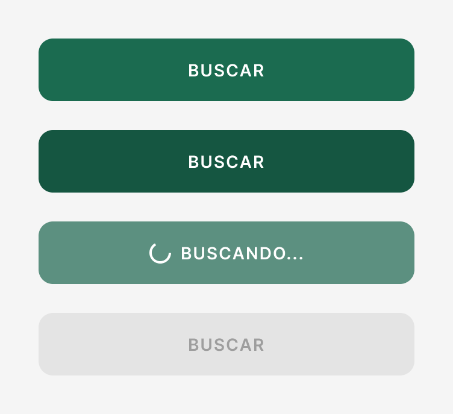

# Componente y estados — Clase 6

**Una sola pieza completa**
Integrantes: Gabriel Mamani Sandoval · Daniel Joaquin Mamani Peña
Fecha: 01/09/2026

Pantalla elegida: **`01 Buscar`** del flujo v0.2.

---

## 1. Elegir

**El botón de acción principal de la pantalla Buscar.**

Por qué necesitaba mejorar: existía y funcionaba, pero estaba resuelto **a mano
dentro de la pantalla**, mezclado con la lógica de búsqueda. No era una pieza
reutilizable, que es lo que la clase pide:

> "Una pieza reutilizable conserva una regla; sus estados explican qué está
> ocurriendo."

Y le faltaba un estado que el flujo sí necesita, con una consecuencia real:
**si escribías `abc` en el campo de precio, la app buscaba igual, ignorando ese
filtro en silencio.** Nunca te avisaba que tu filtro no se había aplicado.

---

## 2. Definir

**Función de la pieza:** disparar la acción principal de la pantalla y decir en
todo momento qué está ocurriendo con ella.

**La regla que conserva:** se reconoce igual en todas las pantallas — mismo alto
(52 px), mismo radio (12 px), etiqueta en mayúsculas, **una sola por pantalla**.
Entre pantallas cambia el texto; entre estados cambian sólo el color y el
contenido interno. **El tamaño nunca cambia**, para que la pantalla no salte al
cambiar de estado.

### Los cuatro estados



| Estado | Qué comunica | Cuándo se alcanza |
|---|---|---|
| **Reposo** | "Esto es lo que sigue." | Los filtros son válidos |
| **Presionado** | "Tu toque se registró." | Mientras el dedo está encima |
| **Cargando** | "Estoy trabajando, esperá." | La consulta a la API está en curso |
| **Deshabilitado** | "Falta algo antes de seguir." | El precio escrito no es un monto válido |

El estado de reposo más tres relevantes: la clase pedía dos, pero *cargando* y
*deshabilitado* responden preguntas distintas y las dos aparecen en este flujo.

**Dos decisiones que vale la pena defender:**

**El estado se deriva, no se pasa por parámetro.** Si quien usa el botón pudiera
fijarlo a mano, tarde o temprano habría un botón en "reposo" que no responde, o
uno "cargando" que ya terminó. Derivarlo hace imposible esa contradicción.

**Deshabilitado siempre viene con su motivo.** Un botón apagado sin explicación
deja a la persona adivinando qué le falta. El texto debajo es lo que convierte
"no anda" en "ya sé qué me falta".

---

## 3. Diseñar — en Figma

Se creó el **component set `Botón principal`** con cuatro variantes nombradas
`Estado=Reposo`, `Estado=Presionado`, `Estado=Cargando` y `Estado=Deshabilitado`,
en su propia página del archivo. La regla y la glosa de cada estado están
escritas en la `description` del componente, así viajan con la pieza.

Se **aplicó a la pantalla `01 Buscar`** como instancia vinculada: si la pieza
cambia, la pantalla cambia con ella. Sólo se sobreescribió la etiqueta, porque
el texto es lo único que cambia entre pantallas.

### Las propiedades de la pieza

El component set expone tres propiedades, y las tres espejan la API del widget
de Flutter — diseño y código exponen exactamente los mismos parámetros:

| Propiedad | Tipo | Equivale en el código a |
|---|---|---|
| `Estado` | Variante | el estado derivado (`reposo`/`presionado`/`cargando`/`deshabilitado`) |
| `Etiqueta` | Texto | `etiqueta:` |
| `Etiqueta cargando` | Texto | `etiquetaCargando:` |

**Para cambiar el estado en Figma:** seleccionar la instancia y usar el
desplegable `Estado` en el panel derecho. Se puede duplicar la instancia y
dejar cada copia en un estado distinto para compararlas.

**Por qué la etiqueta es una propiedad y no texto suelto.** Al principio le
escribí el texto encima a la instancia, y al cambiar de variante **se perdía**:
volvía a decir "BUSCAR". Un override crudo no sobrevive al cambio de variante.
Vinculando el texto a una propiedad, sí:

| Estado | Texto en pantalla |
|---|---|
| Reposo | VER RESULTADOS |
| Presionado | VER RESULTADOS |
| Cargando | **BUSCANDO...** |
| Deshabilitado | VER RESULTADOS |

Recorrido verificado sobre la instancia real: la etiqueta se conserva, la
variante de carga muestra la suya, y el ancho se mantiene en 320 en los cuatro.

> **Un error que apareció al aplicarla.** La instancia entró midiendo 137 px en
> vez de 312. Al ponerle auto-layout a las variantes después de dimensionarlas,
> quedaron en modo *hug* y se encogían al contenido: medían 64, 64, **128** y 64
> — la de "Cargando" el doble, porque su texto es más largo.
>
> Es exactamente la regla de la pieza rompiéndose en la práctica: el tamaño
> cambiaba con el estado. Se corrigió fijando `primaryAxisSizingMode` antes de
> redimensionar.

---

## 4. Implementar — en el código del MVP

`mobile/lib/shared/widgets/boton_principal.dart`

```dart
/// El estado se **deriva**, no se pasa por parámetro.
EstadoBoton get estado {
  if (widget.cargando) return EstadoBoton.cargando;
  if (widget.alTocar == null) return EstadoBoton.deshabilitado;
  if (_presionado) return EstadoBoton.presionado;
  return EstadoBoton.reposo;
}
```

Aplicado en `buscar_screen.dart`, donde `null` en `alTocar` es como la pieza
expresa "falta algo":

```dart
BotonPrincipal(
  etiqueta: 'BUSCAR',
  etiquetaCargando: 'BUSCANDO...',
  alTocar: _precioEsValido ? _buscar : null,
  cargando: _cargando,
  motivoDeshabilitado:
      'Escribí un monto válido o dejá el precio vacío para no filtrar por él.',
)
```

La pantalla ahora escucha el campo de precio para saber si el filtro es
aplicable:

```dart
/// El campo vacío es válido: significa "sin límite de precio".
/// Lo inválido es haber escrito algo que no es un monto.
bool get _precioEsValido {
  final texto = _precioCtrl.text.trim();
  if (texto.isEmpty) return true;
  final n = double.tryParse(texto.replaceAll(',', '.'));
  return n != null && n > 0;
}
```

### Probado

**7 pruebas** en `mobile/test/boton_principal_test.dart` — cuatro para los
estados y tres para la regla:

| Prueba | Qué fija |
|---|---|
| reposo | se puede tocar y muestra su etiqueta |
| presionado | cambia mientras el dedo está encima y vuelve al soltar |
| cargando | avisa qué pasa y **no acepta un segundo toque** |
| deshabilitado | muestra el motivo y no dispara la acción |
| **el tamaño no cambia entre estados** | la regla de la pieza, medida |
| cargando gana a deshabilitado | prioridad entre estados |
| el motivo no aparece si se puede tocar | no agregar ruido |

La quinta es la que más importa: mide el botón en tres estados y falla si alguno
difiere. Es la regla convertida en algo que no se puede romper sin que avise.

---

## 5. Probar

> ⚠️ **Falta completar esta sección probando con una persona.**
> La clase pide observar, no suponer.

**Cómo hacerlo** (10 minutos): pedile a alguien que busque un cuarto usando la
pantalla, **sin explicarle nada**. Los cuatro estados se alcanzan usando la app
normalmente, así que no hace falta forzar nada:

1. Que escriba `abc` en el precio → el botón se apaga y aparece el motivo.
2. Que lo corrija a un número → el botón vuelve.
3. Que toque BUSCAR → aparece `BUSCANDO...`.

Anotá, sin intervenir:

- [ ] ¿Notó que el botón estaba apagado, o intentó tocarlo?
- [ ] ¿Leyó el motivo? ¿Entendió qué corregir?
- [ ] ¿Entendió que el botón estaba trabajando, o volvió a tocarlo?
- [ ] ¿Dijo algo en voz alta? *(la frase textual vale más que un resumen)*

**Observación registrada:**

```
→ Escribir acá lo que hizo la persona, no lo que opinó.
```

**Qué haremos con eso:**

```
→ Completar después de observar.
```
