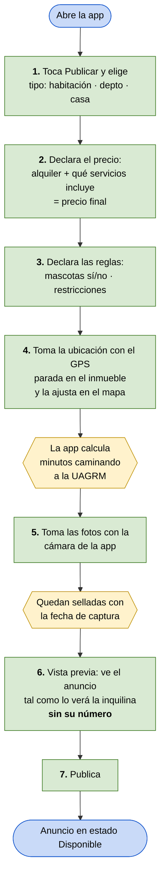
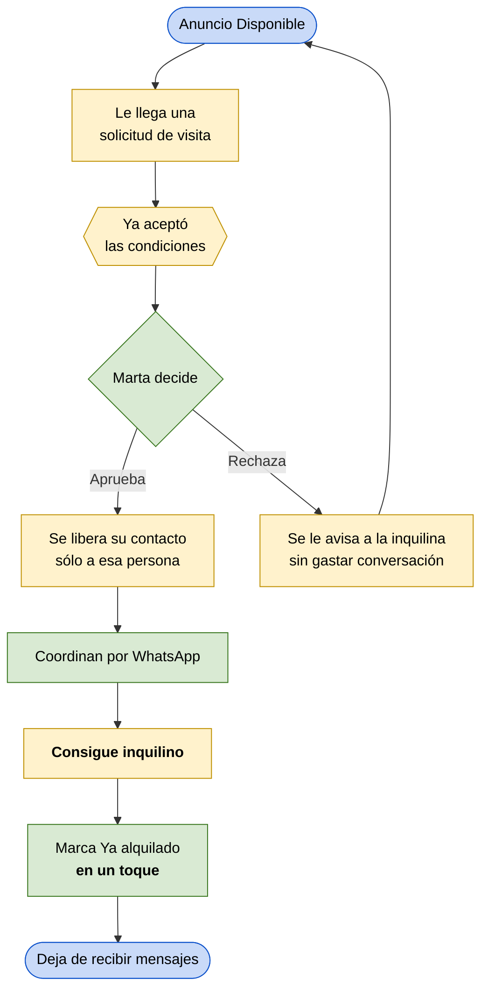

# Flujo v0.1 — Publicar un inmueble

**Integrantes:** Gabriel Mamani Sandoval, Daniel Joaquin Mamani Peña · **Fecha:** 20/08/2026

**Actor:** Marta, la propietaria (`persona/persona-v0.1.md`) · **Tarea:** publicar una habitación disponible de manera que el anuncio filtre solo, sin tener que contestar veinte WhatsApp.
**Entra al flujo porque:** se le desocupó una habitación y en dos semanas arrancan las clases.
**Termina cuando:** el anuncio está publicado, con las cuatro condiciones de descarte visibles y su número **oculto**.

> **Por qué este flujo primero.** Es el lado de la oferta: hasta que Marta no publique, no hay nada que buscar.
> El flujo de la inquilina que busca y solicita la visita será la v0.2 — el paso 7 de este flujo es lo que hace existir el paso 2 de aquél.

---

## Flujo principal — publicar

🟩 pasos de Marta · 🟨 lo que la app hace sola

### Paso a paso

| # | Marta hace | La app responde |
|---|---|---|
| 1 | Toca *Publicar* y elige *Habitación* | Abre el formulario correspondiente al tipo elegido |
| 2 | Pone 700 Bs y tilda *agua* y *luz* como incluidos | Arma y muestra el **precio final: 700 Bs, todo incluido**. Sin este campo no deja avanzar |
| 3 | Marca *No acepto mascotas* y agrega *sólo señoritas* | Guarda las reglas como campos filtrables, no como texto libre |
| 4 | Estando en la casa, toca *Usar mi ubicación* y corrige el pin | Toma el GPS y calcula **"9 min caminando a la UAGRM"** |
| 5 | Fotografía la habitación y el baño desde la app | Sella cada foto con la fecha de captura, visible en el anuncio |
| 6 | Revisa la vista previa | Muestra el anuncio como lo ve la inquilina. **Su teléfono no aparece** |
| 7 | Toca *Publicar* | Deja el anuncio *Disponible* y lo hace visible en la búsqueda |

**El paso 2 es el momento clave**, y es donde el diseño se juega la partida. Es el campo que más le cuesta a Marta (la obliga a sincerar el precio) y el que más le sirve a la inquilina (es su criterio de descarte n.º 1). Si la app no le explica ahí mismo *"declarar esto te evita quince mensajes"*, Marta lo lee como fricción y abandona.

**El paso 6 es el que le vende el beneficio:** ver su propio anuncio sin su número es lo que convierte "me están ocultando el contacto" en "estoy filtrando yo".

---

## Ciclo de vida del anuncio — después de publicar

Publicar no cierra el problema de Marta. Su dolor real (Ev. 7, 8) está en lo que pasa **después**:

| Momento | Qué resuelve | Evidencia |
|---|---|---|
| La solicitud llega con las condiciones ya aceptadas | Marta deja de repetir precio, mascotas y restricciones | Ev. 7 |
| El contacto se libera sólo al aprobar | Publica sin exponer su número y sigue siendo contactable | Ev. 9 |
| *Ya alquilado* en un toque | El anuncio muere cuando debe morir, en un lugar y no en tres | Ev. 8, 11 |

---

## Caminos alternos para la v0.3

- Marta abandona el formulario a medias → guardar borrador y retomarlo.
- Publica desde su casa y no desde el inmueble → cómo se marca una ubicación no verificada.
- No hay señal de GPS dentro de la casa → ajuste manual como única vía.
- Tiene cuatro habitaciones iguales → publicar una y duplicar, en vez de cargar todo de nuevo.
- Aprueba una visita y la persona no llega (Ev. 10) → todavía sin resolver en el alcance actual.
- Se le vence el anuncio sin alquilar → recordatorio de "¿sigue disponible?".

---

## Para la revisión cruzada

> **¿Quién usa la solución?** Marta, dueña de una casa con cuatro habitaciones cerca de la UAGRM. No es inmobiliaria: administra el alquiler desde WhatsApp, en sus ratos libres, y publica en tres grupos de Facebook.
>
> **¿Qué tarea realiza?** Publica una habitación declarando por adelantado precio final, política de mascotas, tipo de espacio y ubicación tomada con el GPS estando en el inmueble, con fotos selladas con fecha. Su número queda oculto hasta que ella aprueba una solicitud.
>
> **¿Por qué así?** Porque hoy Marta paga el filtro con su tiempo: repite las mismas condiciones a quince personas y sigue recibiendo mensajes semanas después de haber alquilado. Poner esas condiciones **en el formulario** hace que el anuncio filtre solo, y marcar *Ya alquilado* en un toque hace que el anuncio muera cuando debe.
