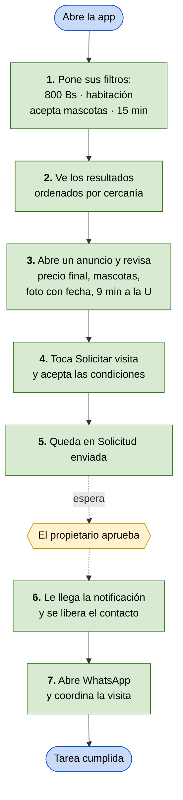

# Flujo v0.2 — Buscar y solicitar una visita

**Integrantes:** Gabriel Mamani Sandoval, Daniel Joaquin Mamani Peña · **Fecha:** 20/08/2026

**Actor:** Andrea, la inquilina (`persona/persona-v0.2.md`) · **Tarea:** encontrar un cuarto que cumpla sus condiciones y conseguir el contacto, sin hacer ningún viaje.
**Entra al flujo porque:** empiezan las clases en dos semanas y todavía no tiene dónde vivir.
**Termina cuando:** tiene el WhatsApp de un propietario cuyo cuarto sigue disponible y cuyas condiciones ya aceptó.

> **La otra mitad de la transacción.** La v0.1 recorrió el lado de la oferta: Marta publica.
> Este recorre el lado de la demanda: Andrea consume lo que Marta cargó. Cada paso de acá depende de un campo que allá fue obligatorio.

---

🟩 pasos de Andrea · 🟨 paso del propietario, fuera de su control

---

## Paso a paso

| # | Andrea hace | La app responde | Viene del flujo v0.1 |
|---|---|---|---|
| 1 | Filtra: hasta 800 Bs, habitación, acepta mascotas, máx. 15 min caminando | Guarda los filtros | Pasos 2, 3 y 4 de Marta |
| 2 | — | Lista los cuartos ordenados por cercanía, con el precio final en cada tarjeta | Paso 7 (sólo aparecen los *Disponible*) |
| 3 | Abre un anuncio y lo lee | Muestra foto con fecha, precio final, servicios, mascotas y "9 min caminando a la UAGRM". **Ningún contacto visible** | Pasos 2 a 5 |
| 4 | Toca *Solicitar visita* y marca *Acepto estas condiciones* | Envía la solicitud al propietario | — |
| 5 | — | Muestra *Solicitud enviada* | — |
| 6 | — | Notifica *Aprobada* y muestra el contacto | Ciclo de vida: Marta aprueba |
| 7 | Toca *Abrir WhatsApp* | Abre el chat para coordinar | — |

**El paso 3 es el momento clave:** ahí decide si sigue o descarta, con los cuatro datos que hoy le faltan. Si no le sirve, vuelve al paso 2 sin haber gastado nada.

La última columna es la que demuestra que los dos flujos son uno solo: **ninguno de los datos del paso 3 existiría si el formulario de Marta no los hubiera exigido.**

**Caminos alternos para la v0.3:** sin resultados, solicitud rechazada o sin respuesta, y cuarto marcado *Ya alquilado* mientras ella espera.

---

## Para la revisión cruzada

> **¿Quién usa la solución?** Andrea, estudiante de la UAGRM, de provincia, sin auto, 800 Bs de presupuesto y un gato. Busca cuarto desde el celular, entre clases.
>
> **¿Qué tarea realiza?** Filtra cuartos por precio final, mascotas y minutos caminando, y pide la visita aceptando esas condiciones por adelantado. El contacto se libera recién cuando el propietario aprueba.
>
> **¿Por qué así?** Porque hoy el contacto se gasta antes de poder descartar: ella pierde el viaje, él pierde la conversación repetida. La app invierte ese orden.
