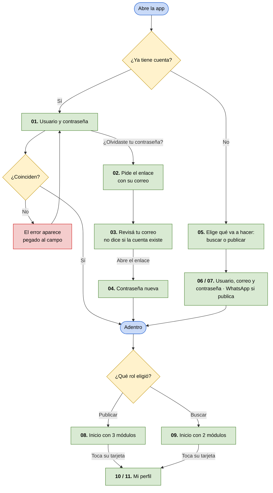

# Flujo v0.3 — Entrar a la app con el rol correcto

**Integrantes:** Gabriel Mamani Sandoval, Daniel Joaquin Mamani Peña · **Fecha:** 06/09/2026 · **Actualizado:** 18/09/2026

**Actor:** cualquiera de las dos. Es el **único flujo que Marta y Andrea recorren igual**.
**Tarea:** entrar a la app y quedar del lado que le corresponde — y, una vez adentro, manejar su cuenta.
**Entra al flujo porque:** alguien le pasó la app y la abre por primera vez, vuelve y la sesión ya venció, o no se acuerda la contraseña.
**Termina cuando:** está adentro y ve los módulos de su rol — que son distintos
para cada una. Esa diferencia es el resultado del flujo, no un detalle.
**Pantallas:** [`wireframes/flujo-v0.3-acceso/`](../wireframes/flujo-v0.3-acceso/README.md) · en Figma, sección *Flujo v0.1 — Acceso*.

> **Por qué esto es un flujo y no un trámite.** Entrar y crear cuenta parecen
> burocracia previa al producto. No lo son: acá se elige el rol, y **el rol
> decide toda la app**. Marta ve *Publicar*, Andrea ve *Buscar*. Un rol mal
> elegido no se corrige desde adentro — hay que crear otra cuenta.
>
> Los otros cuatro flujos empiezan en la pantalla de Inicio. Este es el que
> explica cómo se llega ahí, y por qué esa pantalla muestra cosas distintas a
> cada una.

---

🟩 pasos de la persona · 🟥 el camino que falla · 🟦 entradas y salidas

---

## Paso a paso

Los números son los de las pantallas de la fila Principal en Figma.

| # | La persona hace | La app responde | Por qué importa |
|---|---|---|---|
| 01 | Escribe usuario y contraseña | Habilita *Entrar*; si no coinciden, **el motivo aparece debajo del campo** | Un error que desaparece deja a la persona sin saber qué corregir |
| 02 | Toca *¿Olvidaste tu contraseña?* y escribe su correo | Manda un enlace | Sin esto, olvidar la contraseña es perder la cuenta — y para Marta, sus anuncios |
| 03 | — | *"Si ese correo tiene una cuenta, te llegó un enlace"* | **No dice si el correo existe**: si lo dijera, cualquiera averiguaría quién usa la app probando correos |
| 04 | Abre el enlace y escribe la contraseña nueva dos veces | Entra directo, sin volver a escribirla | Recuperar la cuenta no termina en otro login |
| 05 | Elige *Busco dónde alquilar* o *Quiero publicar* | Hasta que no elija, **el botón está apagado** | Es la decisión que define toda la app |
| 06 / 07 | Completa usuario, **correo** y contraseña | Si eligió publicar, **aparece el campo de WhatsApp** con el aviso de que no se publica | El correo es con lo que se recupera la cuenta; el WhatsApp, el dato que el producto existe para proteger (evidencia 9) |
| 08 / 09 | — | Inicio con **tres** módulos si publica, **dos** si busca | Acá empiezan los flujos v0.1 y v0.2 |
| 10 / 11 | Toca su tarjeta de perfil | **Mi perfil**: usuario, correo y rol; la propietaria además cambia su WhatsApp. Ahí vive *Cerrar sesión* | Si Marta cambia de número, cada visita que apruebe daría uno que ya no sirve |

**El paso 05 es el momento clave.** No es un campo más de un formulario: es la
bifurcación del producto. Por eso se eligen las dos opciones explicadas con lo
que gana cada una, y no un menú desplegable.

**Las 08 y 09, y las 10 y 11, son la misma pantalla.** Cambia lo que cada una
tiene: módulos, y algo que proteger o no. Están dibujadas las dos porque ver una
sola dejaría creer que la app es igual para las dos, que es exactamente lo
contrario de lo que decide el paso 05.

---

## Las tres filas en Figma

| Fila | Pantallas | Qué muestra |
|---|---|---|
| Principal | 11 | Cada pantalla en su estado normal, con los formularios vacíos |
| Happy Path | 14 | Cuatro historias completas —entrar, recuperar la contraseña, crear cuenta (las dos) y cambiar el WhatsApp—, cada acción con el botón pulsado y su resultado |
| Validaciones | 7 | Los errores: datos incorrectos, el enlace vencido, rol sin elegir, datos con error (usuario o correo ya tomados), sin conexión, WhatsApp incompleto y no se pudo guardar |

> **Diferencia con el código, a la fecha.** En Figma, *Elegir rol · sin elegir*
> muestra debajo del botón apagado el motivo *"Elegí si vas a buscar o a
> publicar"*. En la app el botón se apaga sin decir por qué. Queda anotado.

---

## Caminos que este flujo todavía no cubre

- **Cambiar el correo.** Pide confirmar la dirección nueva antes de aceptarla:
  si no, quien agarre el teléfono desbloqueado cambia el correo y después usa
  *recuperar contraseña* para quedarse con la cuenta.
- **Cambiar de rol** sin crear otra cuenta.

---

## Para la revisión cruzada

> **¿Quién usa la solución?** Las dos. Marta entra para publicar, Andrea para
> buscar, y las dos pasan por acá.
>
> **¿Qué tarea realiza?** Entra a la app y elige, una sola vez, de qué lado del
> alquiler está. Si olvida la contraseña, la recupera con su correo sin perder la
> cuenta.
>
> **¿Por qué así?** Porque el rol no es un dato de perfil: es lo que decide qué
> app ve cada una. Elegirlo con las dos opciones explicadas —y no con un menú
> desplegable— es lo que evita que alguien entre del lado equivocado y abandone.
