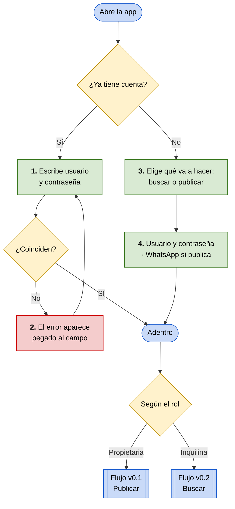

# Flujo v0.3 — Entrar a la app con el rol correcto

**Integrantes:** Gabriel Mamani Sandoval, Daniel Joaquin Mamani Peña · **Fecha:** 06/09/2026

**Actor:** cualquiera de las dos. Es el **único flujo que Marta y Andrea recorren igual**.
**Tarea:** entrar a la app y quedar del lado que le corresponde.
**Entra al flujo porque:** alguien le pasó la app y la abre por primera vez, o vuelve y la sesión ya venció.
**Termina cuando:** está adentro y ve los módulos de su rol.

> **Por qué esto es un flujo y no un trámite.** Entrar y crear cuenta parecen
> burocracia previa al producto. No lo son: acá se elige el rol, y **el rol
> decide toda la app**. Marta ve *Publicar*, Andrea ve *Buscar*. Un rol mal
> elegido no se corrige desde adentro — hay que crear otra cuenta.
>
> Los flujos v0.1 y v0.2 empiezan los dos en la pantalla de Inicio. Este es el
> que explica cómo se llega ahí, y por qué esa pantalla muestra cosas distintas
> a cada uno.

---

🟩 pasos de la persona · 🟥 el camino que falla · 🟦 entradas y salidas

---

## Paso a paso

| # | La persona hace | La app responde | Por qué importa |
|---|---|---|---|
| 1 | Escribe usuario y contraseña | Habilita *Entrar* | — |
| 2 | Se equivoca | **El motivo aparece debajo del campo**, no en un cartel que se va solo | Un error que desaparece deja a la persona sin saber qué corregir |
| 3 | Elige *Busco dónde alquilar* o *Quiero publicar* | Hasta que no elija, **el botón está apagado y dice por qué** | Es la decisión que define toda la app; dejarla implícita es lo peor que puede pasar acá |
| 4 | Completa usuario y contraseña | Si eligió publicar, **aparece el campo de WhatsApp** con el aviso de que no se publica | El WhatsApp es el dato que el producto existe para proteger (evidencia 9) |
| 5 | — | Entra al Inicio, con los módulos de su rol | Acá empieza el v0.1 o el v0.2 |

**El paso 3 es el momento clave.** No es un campo más de un formulario: es la
bifurcación del producto. Por eso el botón nace deshabilitado con su motivo a la
vista, en vez de dejar tocar y contestar con un error.

---

## Los dos estados que el wireframe documenta a propósito

Un flujo dibujado sólo en su camino feliz no sirve para revisar nada. Las
pantallas `02` y `03` son los dos momentos en que esto se rompe:

- **`02 No entra`** — la contraseña no coincide. El campo se pone en rojo y el
  motivo va pegado a él. La pantalla no cambia de tamaño: sólo el borde y el
  mensaje, para que nada salte.
- **`03 Elegir rol`** — nadie eligió todavía. El botón está apagado y debajo
  dice *"Elegí si vas a buscar o a publicar"*.

> **Diferencia con el código, a la fecha.** En la app ese aviso del paso 3 es
> hoy un *snackbar* que aparece recién al tocar el botón. El wireframe propone
> mostrarlo antes. Está anotado como pendiente de implementar.

---

## Caminos que este flujo todavía no cubre

- Contraseña olvidada.
- Usuario ya tomado (el backend lo rechaza; falta dibujar cómo se ve).
- Cambiar de rol sin crear otra cuenta.

---

## Para la revisión cruzada

> **¿Quién usa la solución?** Las dos. Marta entra para publicar, Andrea para
> buscar, y las dos pasan por acá.
>
> **¿Qué tarea realiza?** Entra a la app y elige, una sola vez, de qué lado del
> alquiler está.
>
> **¿Por qué así?** Porque el rol no es un dato de perfil: es lo que decide qué
> app ve cada una. Elegirlo con las dos opciones explicadas —y no con un menú
> desplegable— es lo que evita que alguien entre del lado equivocado y abandone.
