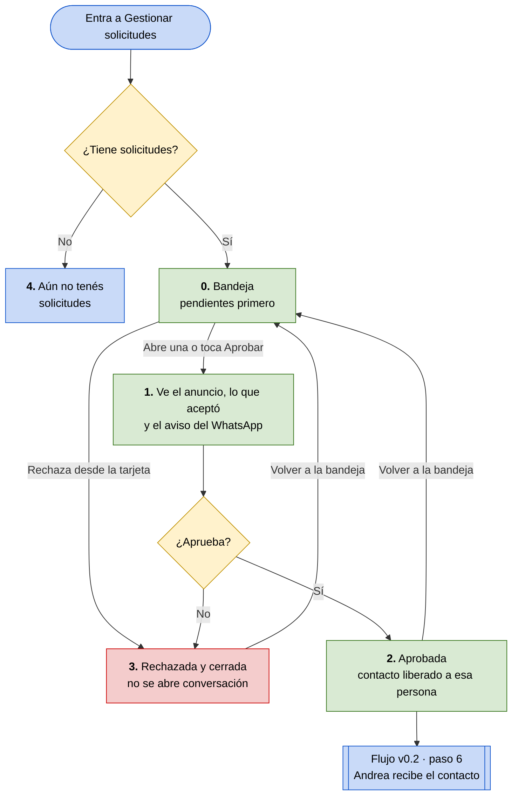

# Flujo v0.4 — Aprobar o rechazar una visita

**Integrantes:** Gabriel Mamani Sandoval, Daniel Joaquin Mamani Peña · **Fecha:** 10/09/2026

**Actor:** Marta, la propietaria (`persona/persona-v0.1.md`).
**Tarea:** responder las solicitudes de visita a sus anuncios.
**Entra al flujo porque:** una inquilina aceptó las condiciones de un anuncio y pidió la visita (paso 4 del flujo v0.2).
**Termina cuando:** la solicitud queda aprobada, con el WhatsApp liberado sólo a esa persona, o rechazada y cerrada.
**Wireframes:** página *Flujo v0.4 - Gestion de solicitudes* del [archivo de Figma](https://www.figma.com/design/kAU2JWOHr8JluthuoakVzw).

> **Por qué este flujo cierra el producto.** El flujo v0.2 termina con Andrea
> esperando una respuesta, y su paso 6 dice *"notifica Aprobada y muestra el
> contacto"*. Alguien tiene que aprobar, y ese alguien es Marta. Acá vive la
> regla central de la app: **el WhatsApp no existe para nadie hasta que ella
> dice que sí**.

---

🟩 pasos de la persona · 🟥 el camino del no · 🟦 entradas y salidas

---

## Paso a paso

| # | Marta hace | La app responde | Por qué importa |
|---|---|---|---|
| 0 | Entra a *Gestionar solicitudes* | Lista las solicitudes con **las pendientes primero**. Las respondidas quedan abajo, con borde y etiqueta de su color | Las pendientes son las únicas que piden algo |
| 1 | Abre una solicitud, o toca *Aprobar* en su tarjeta | Muestra el anuncio, **las condiciones que esa persona ya aceptó** y, antes del botón, *"Esta persona va a ver tu WhatsApp. Sólo ella."* | No repite las mismas condiciones a quince personas (evidencia 7), y sabe a quién le da el número antes de darlo |
| 2 | Toca *Aprobar y liberar mi WhatsApp* | La marca **aprobada** y dice *"Contacto liberado a andrea"* | El WhatsApp es el dato que el producto existe para proteger (evidencia 9) |
| 3 | Toca *Rechazar* | La marca **rechazada y cerrada**, sin pedir un motivo | Rechazar no puede abrir la conversación que Marta quiere evitar |
| 4 | — | Si no hay ninguna, lo dice: *"Aún no tenés solicitudes"* | Una bandeja vacía sin explicación parece rota |

**El paso 1 es el momento clave.** Aprobar es lo único irreversible del flujo:
una vez liberado, el número ya lo tiene esa persona. Por eso *Aprobar* en la
tarjeta no aprueba, abre el detalle, y el botón dice lo que hace —*Aprobar y
liberar mi WhatsApp*— en vez de un *Aprobar* a secas. Rechazar sí se resuelve
desde la tarjeta, porque no libera nada.

**Las pantallas 1, 2 y 3 son la misma.** Arriba nunca cambia: el anuncio, las
condiciones y el aviso. Cambia sólo el bloque de la decisión, así Marta no
pierde de vista a quién le está respondiendo.

---

## En tablet y escritorio

Las dos pantallas usan la fila de 12 columnas de la Clase 8. Los bloques no se
achican: cambian de fila.

| Pantalla | Detalle de la solicitud | Bandeja |
|---|---|---|
| Teléfono | Condiciones y decisión a 12 columnas, una debajo de la otra | Una tarjeta por fila |
| Tablet | 6 + 6 | Dos tarjetas por fila |
| Escritorio | Condiciones en 8, decisión en 4 | Tres tarjetas por fila |

En el código, cada lugar donde se aplican las cuatro ideas —Auto Layout,
Flexbox, Constraints y Grid— está marcado con un comentario con su nombre. La
grilla es una pieza reutilizable: `mobile/lib/shared/layout/grilla.dart`.

---

## Caminos que este flujo todavía no cubre

- **Avisarle a la inquilina en el momento.** Hoy ve la respuesta cuando
  actualiza *Mis solicitudes*. La pantalla 3 dice *"El inquilino fue
  notificado"*: va a ser cierto cuando exista ese aviso.
- **Deshacer una aprobación.** No hay vuelta atrás, y es a propósito.
- **Varias solicitudes para el mismo anuncio.** Aprobar una no cierra las
  demás, y si el cuarto se marca alquilado, las pendientes siguen abiertas.

---

## Para la revisión cruzada

> **¿Quién usa la solución?** Marta, la propietaria que publica.
>
> **¿Qué tarea realiza?** Decide a quién le libera su WhatsApp entre las
> personas que pidieron visitar su cuarto.
>
> **¿Por qué así?** Porque el contacto es lo caro para los dos lados. Antes de
> aprobar ve a quién y con qué condiciones, y rechazar no la obliga a dar
> explicaciones por WhatsApp.
