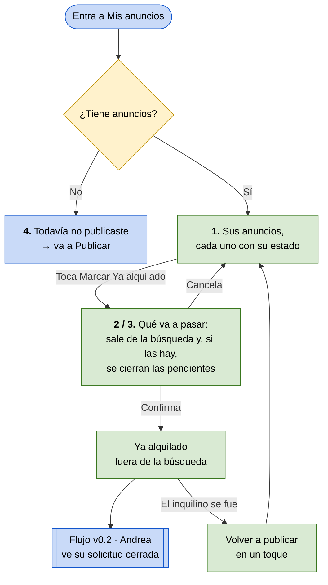

# Flujo v0.5 — Cerrar el anuncio cuando se alquila

**Integrantes:** Gabriel Mamani Sandoval, Daniel Joaquin Mamani Peña · **Fecha:** 18/09/2026

**Actor:** Marta, la propietaria (`persona/persona-v0.1.md`).
**Tarea:** marcar su anuncio como *Ya alquilado* cuando consigue inquilino, y volver a publicarlo si el inquilino se va.
**Entra al flujo porque:** ya tiene inquilino — casi siempre después de aprobar una visita (flujo v0.4).
**Termina cuando:** el anuncio está *Ya alquilado*, fuera de la búsqueda, y las solicitudes que seguían pendientes quedaron cerradas con un aviso a cada persona.
**Wireframes:** sección *Flujo v0.5 — Cerrar el anuncio* de la página *Flujos* del [archivo de Figma](https://www.figma.com/design/kAU2JWOHr8JluthuoakVzw).

> **Por qué este flujo es el último.** Los otros cuatro cuentan el principio y
> el medio de un alquiler: entrar, publicar, buscar y pedir visita, aprobar.
> Ninguno cuenta el final, y sin final **el anuncio no muere**: Andrea le
> escribe a cuartos que ya no existen (evidencia 5) y a Marta le siguen
> llegando mensajes un mes después de haber alquilado (evidencia 8). Es el
> único módulo del app map —*3. Gestionar mis anuncios*— que no tenía flujo.

---

🟩 pasos de la persona · 🟦 entradas y salidas · 🟨 lo que decide el camino

---

## Paso a paso

| # | Marta hace | La app responde | Por qué importa |
|---|---|---|---|
| 1 | Entra a *Mis anuncios* | Lista sus anuncios con su estado —*Disponible* o *Ya alquilado*— y la acción de cada uno | Un anuncio sin estado visible es el que no muere (evidencias 5, 8 y 11) |
| 2 | Toca *Marcar Ya alquilado* | Antes de hacerlo dice qué va a pasar: sale de la búsqueda, se cierran las solicitudes pendientes y a cada persona se le avisa | Cierra pedidos de otras personas: eso no puede pasar sin que ella lo sepa |
| 3 | …en un cuarto **sin** pendientes | La misma pantalla, y dice *"No tenés solicitudes pendientes: no se cierra ninguna"* | El botón hace siempre lo mismo, y ella sabe antes de tocar que nadie queda colgado |
| 3 | Confirma | Queda *Ya alquilado* y la app dice *"Salió de la búsqueda. Cerramos 2 solicitudes y les avisamos."* | Sabe exactamente qué cambió, sin tener que ir a revisar |
| 4 | El inquilino se fue: toca *Volver a publicar* | Vuelve a la búsqueda en un toque, con los mismos datos | Volver a publicar no puede costar lo mismo que publicar de cero (evidencia 11) |
| 5 | — | Si no tiene anuncios: *"Todavía no publicaste nada"* y el botón para publicar | Una lista vacía sin explicación parece rota |

**El paso 2 es el momento clave, y responde una pregunta abierta del brief:**
*¿qué motiva a Marta a marcar el anuncio si ya consiguió inquilino?* La
respuesta está en la evidencia 8 —*"me siguen escribiendo, ya ni contesto"*—:
no lo marca para ayudar a Andrea, lo marca **para dejar de recibir
solicitudes**. Por eso la confirmación habla de lo que ella gana, no de un
trámite.

**Siempre confirma (cambiado el 20/09/2026).** Antes la confirmación aparecía
sólo con solicitudes pendientes, y sin ellas el anuncio se marcaba en un toque.
Probándolo se vio el problema: el mismo botón hacía dos cosas distintas según
datos que la tarjeta no muestra, así que era imposible saber qué iba a pasar
antes de tocarlo. Ahora siempre se pasa por la pantalla: es la acción que menos
se puede deshacer —saca el anuncio de la búsqueda y cierra lo que otras personas
esperaban— y lo que cambia es lo que se cuenta, no el camino. El *"en un toque"*
del brief sigue valiendo para *Volver a publicar*, que es lo barato de rehacer.

---

## Las tres filas en Figma

| Fila | Pantallas | Qué muestra |
|---|---|---|
| Principal | 01 Mis anuncios · 02 ¿Ya lo alquilaste? · 03 ¿Ya lo alquilaste? · sin pendientes · 04 Sin anuncios | Cada pantalla distinta del flujo, en su estado normal |
| Happy Path | 01 marcar (botón pulsado) · 02 marcando · 03 alquilado · 04 publicado otra vez | Cada acción con el botón tocado y su resultado |
| Validaciones | 01 no se pudo cargar · 02 no se pudo marcar · 03 no se pudo volver a publicar | Sólo lo que falla, con cómo reintentar |

El prototipo arranca en *01 Mis anuncios*. Desde el estado vacío, *Publicar
anuncio* lleva directo al flujo v0.1.

---

## Qué hay en el código

El flujo está implementado de punta a punta y verificado en el emulador contra
el backend real:

- `POST /api/anuncios/{id}/marcar_alquilado/` cierra en la misma operación las
  solicitudes que seguían pendientes y devuelve cuántas cerró; el aviso de la
  app lo usa (*"Salió de la búsqueda. Cerramos 2 solicitudes y les avisamos"*).
- La confirmación es `ConfirmarAlquiladoScreen`, y se pasa por ella siempre.
- Del otro lado, Andrea ve *"El cuarto ya se alquiló"* en lugar de una espera
  eterna (pantalla 11 del flujo de la inquilina).

---

## Caminos que este flujo todavía no cubre

- **Editar el anuncio.** Es la otra mitad del módulo 3 del app map.
- **Recordatorio de *"¿sigue disponible?"*** cuando un anuncio pasa semanas sin
  movimiento (anotado en el flujo v0.1).
- **Una solicitud ya aprobada** cuando el cuarto se alquila a otra persona:
  esa persona tiene el WhatsApp y hay que decidir si se le avisa.

---

## Para la revisión cruzada

> **¿Quién usa la solución?** Marta, la propietaria que publica.
>
> **¿Qué tarea realiza?** Avisa, una sola vez y en un solo lugar, que el cuarto
> ya no está disponible.
>
> **¿Por qué así?** Porque hoy lo hace en tres grupos de Facebook (evidencia 11)
> o directamente no lo hace, y le siguen escribiendo (evidencia 8). Acá marcarlo
> es lo que la libera a ella de los mensajes, y a Andrea de pedir cuartos que ya
> no existen (evidencia 5).
