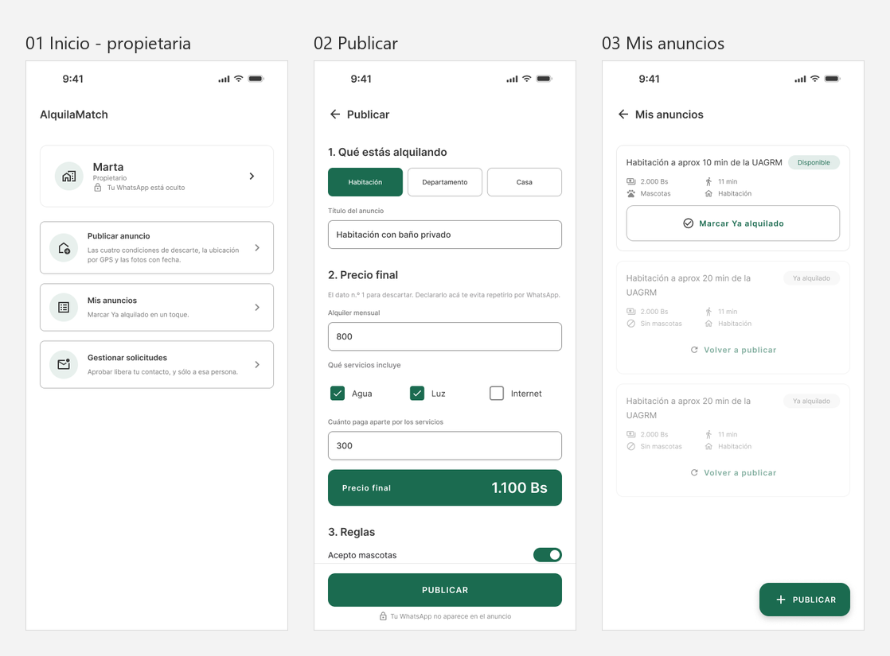

# Wireframes — Flujo v0.1 · Marta, la propietaria

**Integrantes:** Gabriel Mamani Sandoval, Daniel Joaquin Mamani Peña
**Flujo:** [`flujo/flujo-v0.1.md`](../../flujo/flujo-v0.1.md) · **Reglas de dibujo:** [`_lenguaje-visual.md`](../_lenguaje-visual.md)

Cinco pantallas, 360 × 800, escala de grises. Exportadas desde Figma, así que
cada `.svg` entra al archivo con capas, formas reales y nombres — no como
imagen plana.

## El flujo completo de un vistazo

Las cinco pantallas lado a lado, en el orden del flujo. Sirve para revisar el
recorrido entero sin abrir Figma ni los SVG uno por uno.

## Por qué casi no hay texto

El contenido va como barras grises y **el único texto real es el título de cada
pantalla**. Es deliberado, y responde a la pregunta que abre la Clase 5:

> "La pregunta no es «¿qué color tendrá el botón?». La primera pregunta es
> «¿María entiende qué puede hacer y qué ocurrirá después?»"

Sin los textos definitivos, la revisión sólo puede ser sobre lo que importa en
esta etapa: qué se reconoce primero, qué se agrupa con qué y cuál es la acción
principal. El título se conserva porque orienta — es el paso 1 de la jerarquía.

## Las pantallas

| # | Archivo | Momento de la tarea |
|---|---|---|
| 01 | [`01 Ingresar.svg`](01%20Ingresar.svg) | Entra a la app |
| 02 | [`02 Crear cuenta.svg`](02%20Crear%20cuenta.svg) | **Elige el rol**: buscar o publicar |
| 03 | [`03 Inicio.svg`](03%20Inicio.svg) | Ve sus tres módulos como propietaria |
| 04 | [`04 Publicar.svg`](04%20Publicar.svg) | **Declara las condiciones de descarte** |
| 05 | [`05 Mis anuncios.svg`](05%20Mis%20anuncios.svg) | Marca *Ya alquilado* en un toque |

## Cómo leer la 04

Es la pantalla donde el producto se juega la partida, y por eso está dividida
en cinco secciones numeradas:

- **El bloque del precio final** es el más oscuro y grueso de la pantalla. Es
  el campo que más le cuesta a Marta —la obliga a sincerar el precio— y el que
  más le sirve a la inquilina, porque es su criterio de descarte n.º 1.
- **El campo de costo aparte** sólo aparece si algún servicio queda afuera. El
  backend rechaza publicar con servicios no incluidos y costo en cero:
  publicar sólo el alquiler es lo que hoy hace perder viajes.
- **Ubicación y fotos** son dos botones, no dos formularios. Se resuelven con
  el GPS y la cámara del teléfono estando en el inmueble, que es el argumento
  de por qué este producto es móvil y no web.
- Al pie, la nota de que **su WhatsApp no aparece en el anuncio**.

## La diferencia con el flujo v0.2

Este flujo es el **lado de la oferta**: hasta que Marta no publique, no hay
nada que buscar. Cada campo obligatorio de la pantalla 04 es exactamente un
dato que la inquilina necesita para descartar sin viajar — se ve en
[`../flujo-v0.2-inquilina/`](../flujo-v0.2-inquilina/README.md).

## Importarlos a Figma

Se arrastran los `.svg` al lienzo. Entran como grupos editables, no como
imágenes: se pueden mover, redimensionar y renombrar las capas.
