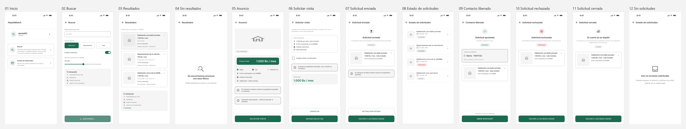

# Wireframes — Flujo v0.2 · Andrea, la inquilina

**Integrantes:** Gabriel Mamani Sandoval, Daniel Joaquin Mamani Peña
**Flujo:** [`flujo/flujo-v0.2.md`](../../flujo/flujo-v0.2.md) · **Reglas de dibujo:** [`_lenguaje-visual.md`](../_lenguaje-visual.md)

Seis pantallas, 360 × 800, escala de grises, exportadas desde Figma.

Están en PNG: se ven directamente en GitHub, pero **no se pueden reimportar a
Figma con capas editables**. Si hace falta volver a editarlas, la fuente es el
archivo de Figma, no estos archivos.

## El flujo completo de un vistazo

Las seis pantallas lado a lado, en el orden del flujo. Sirve para revisar el
recorrido entero sin abrir Figma ni los SVG uno por uno.

## Por qué casi no hay texto

El contenido va como barras grises y **el único texto real es el título de cada
pantalla**. Es deliberado, y responde a la pregunta que abre la Clase 5:

> "La pregunta no es «¿qué color tendrá el botón?». La primera pregunta es
> «¿María entiende qué puede hacer y qué ocurrirá después?»"

Un wireframe que ya trae los textos definitivos invita a discutir la redacción
antes de tiempo. Sin ellos, la revisión sólo puede ser sobre lo que importa en
esta etapa: qué se reconoce primero, qué se agrupa con qué y cuál es la acción
principal. El título se conserva porque orienta — es el paso 1 de la jerarquía.

## Las pantallas

| # | Archivo | Momento de la tarea |
|---|---|---|
| 01 | [`01 Buscar.png`](01%20Buscar.png) | Pone sus filtros: precio, tipo, mascotas, minutos |
| 02 | [`02 Resultados.png`](02%20Resultados.png) | Ve los resultados ordenados por cercanía |
| 03 | [`03 Anuncio.png`](03%20Anuncio.png) | **Decide si le sirve o lo descarta** |
| 04 | [`04 Solicitar visita.png`](04%20Solicitar%20visita.png) | Acepta las condiciones y pide la visita |
| 05 | [`05 Solicitud enviada.png`](05%20Solicitud%20enviada.png) | Queda a la espera de la respuesta |
| 06 | [`06 Contacto liberado.png`](06%20Contacto%20liberado.png) | El propietario aprobó: aparece el contacto |

## Cómo leer la 03

Es la pantalla que decide el producto, y ya incluye la corrección que salió de
la prueba con una usuaria (ver [`docs/decision-clase-05.md`](../../docs/decision-clase-05.md)):

- La barra del **precio final** es más alta y más oscura que las demás: es el
  criterio de descarte n.º 1, así que domina por tamaño y peso.
- Los **tres servicios** van pegados a esa barra, y el que **no** está incluido
  aparece con el círculo vacío en vez de omitirse. Omitirlo fue lo que obligó a
  la usuaria a preguntar *"¿cuánto es con luz?"*.
- Los otros tres datos comparten peso entre sí, agrupados en el mismo
  contenedor porque se leen como una sola decisión.
- **No hay ningún contacto.** El teléfono del propietario no existe en esta
  pantalla: recién aparece en la 06, después de la aprobación.

## La fuente editable

Estas imágenes son una copia para revisar desde GitHub. Para editarlas hay que
abrir el archivo de Figma, en la página *Flujo v0.2 — Inquilina ‑sin letters*.
