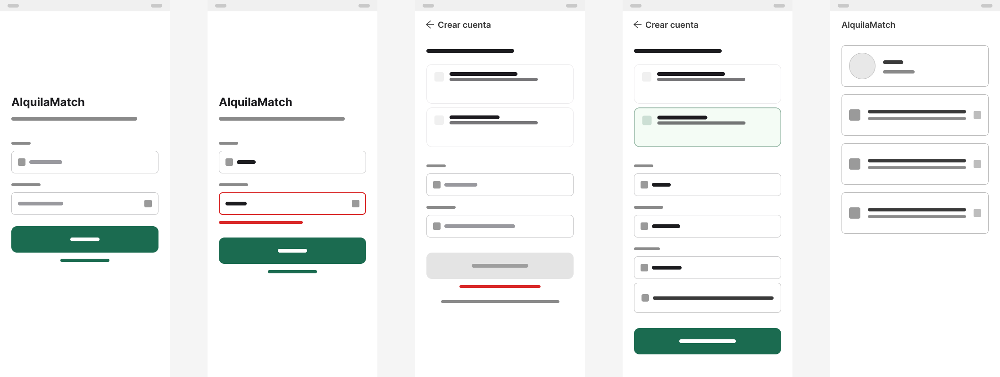

# Wireframes — Flujo v0.3 · Entrar con el rol correcto

**Integrantes:** Gabriel Mamani Sandoval, Daniel Joaquin Mamani Peña
**Flujo:** [`flujo/flujo-v0.3.md`](../../flujo/flujo-v0.3.md) · **Reglas de dibujo:** [`_lenguaje-visual.md`](../_lenguaje-visual.md)

Cinco pantallas, 360 × 800, escala de grises, exportadas desde Figma.

## El flujo completo de un vistazo

## Por qué casi no hay texto

El contenido va como barras grises y **el único texto real es el título de cada
pantalla**. Es deliberado, y responde a la pregunta que abre la Clase 5:

> "La pregunta no es «¿qué color tendrá el botón?». La primera pregunta es
> «¿María entiende qué puede hacer y qué ocurrirá después?»"

Sin los textos definitivos, la revisión sólo puede ser sobre lo que importa en
esta etapa: qué se reconoce primero, qué se agrupa con qué y cuál es la acción
principal. El título se conserva porque orienta — es el paso 1 de la jerarquía.

## Las pantallas

| # | Archivo | Momento de la tarea |
|---|---|---|
| 01 | [`01 Ingresar.png`](01%20Ingresar.png) | Ya tiene cuenta y entra |
| 02 | [`02 No entra.png`](02%20No%20entra.png) | **Se equivocó**: el motivo va pegado al campo |
| 03 | [`03 Elegir rol.png`](03%20Elegir%20rol.png) | **Sin rol elegido**: el botón está apagado y dice por qué |
| 04 | [`04 Crear cuenta.png`](04%20Crear%20cuenta.png) | Eligió publicar → aparece el WhatsApp y su aviso |
| 05 | [`05 Adentro.png`](05%20Adentro.png) | Dónde cae: los módulos los decide el rol |

**Dos de las cinco son estados de error.** Es a propósito: un flujo dibujado
sólo en su camino feliz no sirve para revisar nada. La `02` y la `03` son
justamente los dos momentos en que esto se rompe.

## Cómo leer la 03

Es la pantalla que decide el producto:

- Los dos roles se muestran **con lo que gana cada uno**, no con el nombre del
  rol. Dice *"Busco dónde alquilar"*, no *"Inquilino"*.
- El botón **nace deshabilitado**, y debajo explica qué falta. Un botón apagado
  sin motivo deja a la persona adivinando.
- El rol elegido se marca **con el fondo**, no sólo con el borde: tiene que
  reconocerse de un vistazo cuál quedó seleccionado.

## Cómo leer la 04

Al elegir *Quiero publicar* aparece un campo que antes no estaba: el **WhatsApp**,
con el aviso de que *no aparece en tus anuncios*. Ese dato es la razón de ser del
producto (evidencia 9: *"no pongo mi número porque después te escriben para
cualquier cosa, pero si no lo pongo nadie te contacta"*), así que la promesa de
protegerlo se hace en el momento exacto en que se lo pide.

## La relación con los otros dos flujos

Los flujos [v0.1](../flujo-v0.1-propietario/README.md) y
[v0.2](../flujo-v0.2-inquilina/README.md) empiezan los dos en la pantalla de
Inicio. **Este es el que explica cómo se llega ahí**, y por qué esa misma
pantalla le muestra cosas distintas a cada una.

## La fuente editable

Estas imágenes son una copia para revisar desde GitHub. Para editarlas hay que
abrir el archivo de Figma, en la página *Flujo v0.3 — Acceso*. Las cinco
pantallas están armadas con **instancias** de los componentes de la página
*Sistema visual*, no con formas sueltas.
