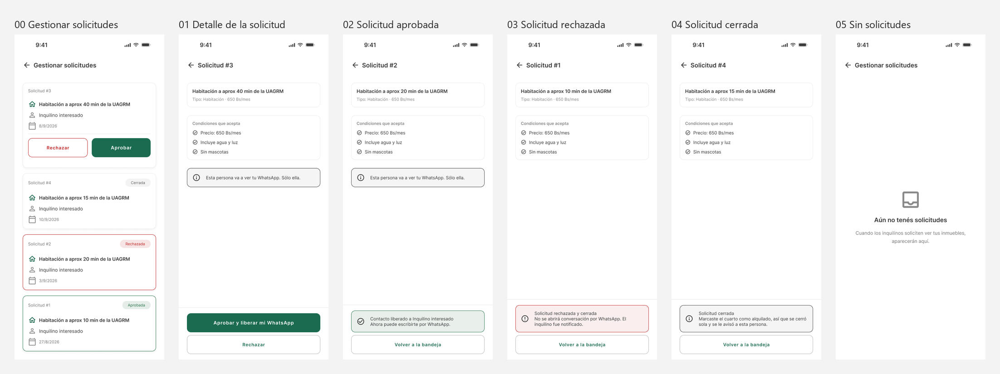

# Pantallas — Flujo v0.4 · Marta aprueba o rechaza una visita

**Integrantes:** Gabriel Mamani Sandoval, Daniel Joaquin Mamani Peña
**Flujo:** [`flujo/flujo-v0.4.md`](../../flujo/flujo-v0.4.md) · **Figma:** página *Flujos*, sección *Flujo v0.4 — Gestión de solicitudes*

Seis pantallas de 440 × 956, exportadas de la fila **Principal** del archivo de
Figma. Los caminos completos (*Happy Path*) y los errores (*Validaciones*) están
en las otras dos filas de la misma sección.

| # | Archivo | Momento de la tarea |
|---|---|---|
| 00 | [`00 Gestionar solicitudes.png`](00%20Gestionar%20solicitudes.png) | La bandeja, con las pendientes primero y después la más nueva |
| 01 | [`01 Detalle de la solicitud.png`](01%20Detalle%20de%20la%20solicitud.png) | **Ve a quién le libera el WhatsApp antes de hacerlo** |
| 02 | [`02 Solicitud aprobada.png`](02%20Solicitud%20aprobada.png) | Contacto liberado, sólo a esa persona |
| 03 | [`03 Solicitud rechazada.png`](03%20Solicitud%20rechazada.png) | Rechazada y cerrada, sin abrir conversación |
| 04 | [`04 Solicitud cerrada.png`](04%20Solicitud%20cerrada.png) | Se cerró sola: marcó el cuarto como alquilado (flujo v0.5) |
| 05 | [`05 Sin solicitudes.png`](05%20Sin%20solicitudes.png) | La bandeja vacía, dicha en vez de parecer rota |

**Las pantallas 01 a 04 son la misma.** Arriba nunca cambia —el anuncio y lo que
la persona aceptó—; cambia sólo el bloque de la decisión. Así Marta no pierde de
vista a quién le está respondiendo. El aviso *"Esta persona va a ver tu
WhatsApp. Sólo ella."* está mientras decide y en la aprobada; en la rechazada y
la cerrada no, porque ya no es cierto.
