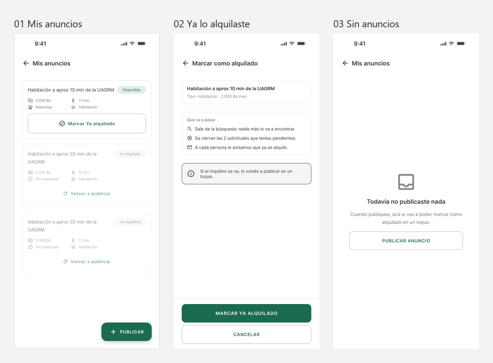

# Pantallas — Flujo v0.5 · Marta cierra el anuncio

**Integrantes:** Gabriel Mamani Sandoval, Daniel Joaquin Mamani Peña
**Flujo:** [`flujo/flujo-v0.5.md`](../../flujo/flujo-v0.5.md) · **Figma:** página *Flujos*, sección *Flujo v0.5 — Cerrar el anuncio*

Tres pantallas de 440 × 956, exportadas de la fila **Principal** del archivo de
Figma. Los caminos completos (*Happy Path*) y los errores (*Validaciones*) están
en las otras dos filas de la misma sección.

| # | Archivo | Momento de la tarea |
|---|---|---|
| 01 | [`01 Mis anuncios.png`](01%20Mis%20anuncios.png) | Ve sus anuncios, cada uno con su estado |
| 02 | [`02 Ya lo alquilaste.png`](02%20Ya%20lo%20alquilaste.png) | **Antes de cerrar, ve qué va a pasar** |
| 03 | [`03 Sin anuncios.png`](03%20Sin%20anuncios.png) | Todavía no publicó nada: el botón la lleva a publicar |

## Cómo leer la 02

Sólo aparece si el cuarto tiene solicitudes pendientes. Sin pendientes, marcarlo
es un toque, como pide el brief. Con pendientes deja de ser una decisión sólo
suya, porque cierra lo que otras personas estaban esperando.

No pregunta *"¿estás segura?"*: dice qué va a pasar —sale de la búsqueda, se
cierran las pendientes, se le avisa a cada persona—. La pregunta sola no da nada
para decidir; la lista, sí.
